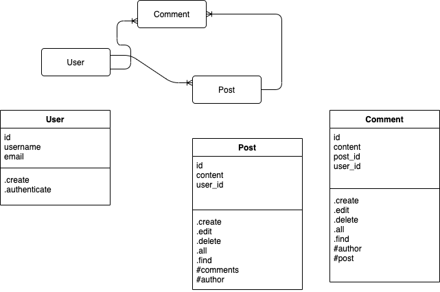

# Process

Started off with a simple class diagram and entity relation model

Now to setup rakefile and database for development and test

Rake setup to create and drop the test and dev databases, and run migration 
for simple version of post table. Each step manually tested then committed.